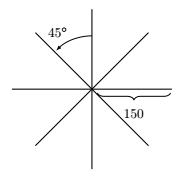
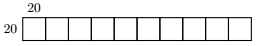
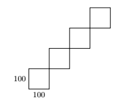
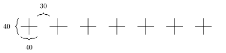

Inleveropdrachten
:::::::::::::::::

opg-iteration-ster
-------------------

Teken de onderstaande figuur (m.b.v. een *loop*).

.. activecode:: opg-iteration-ster
   :caption: Ster
   :nocodelens:
   :language: python

   import turtle
   tina = turtle.Turtle()
   tina.shape("turtle")

opg-iteration-hokjes
---------------------

Teken de onderstaande figuur (m.b.v. een *loop*).

.. activecode:: opg-iteration-hokjes
   :caption: Hokjes
   :nocodelens:
   :language: python

   import turtle
   tina = turtle.Turtle()
   tina.shape("turtle")

opg-iteration-zigzag
--------------------

Teken de onderstaande figuur (m.b.v. een *loop*).

.. activecode:: opg-iteration-zigzag
   :caption: Zigzag
   :nocodelens:
   :language: python

   import turtle
   tina = turtle.Turtle()
   tina.shape("turtle")

opg-iteration-kruizen
---------------------

Teken de onderstaande figuur (m.b.v. een *loop*).

.. activecode:: opg-iteration-kruizen
   :caption: Kruizen
   :nocodelens:
   :language: python

   import turtle
   tina = turtle.Turtle()
   tina.shape("turtle")
