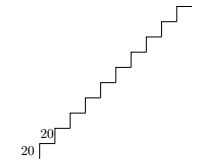

Oefenopdrachten (2): Patronen
:::::::::::::::::::::::::::::

Hieronder staan een aantal beginnetjes code en een voorbeeldfiguur. Pas de code telkens op zo'n manier aan dat de turtle de figuur tekent. De afmetingen staan in de figuur vermeld, die getallen hoef je er dus niet bij te zetten.

1. Trap
---------------

Teken de onderstaande trap met zo min mogelijk regels code.

.. activecode:: oefen-iteration-trap
   :caption: Trap
   :nocodelens:
   :language: python

   import turtle
   tina = turtle.Turtle()
   tina.shape("turtle")
