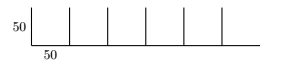
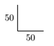
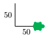
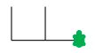

Patronen
::::::::

We gaan nu verder met nog meer uitleg. We zijn geïnteresseerd om het volgende figuurtje te tekenen door gebruik te maken van een loop:

Het eerste dat je doet is bepalen welk patroon steeds terugkeert. Dat moet je immers herhalen! Je zou bijvoorbeeld het volgende stukje als het te herhalen patroon kunnen aanmerken:

Uitgaande van de situatie dat je naar boven kijkt, zou je dit gedeelte als volgt kunnen maken:

.. code-block:: python

   tina.forward(50)
   tina.backward(50)
   tina.right(90)
   tina.forward(50)

Nadat we de bovenstaande regels hebben uitgevoerd kijkt de turtle naar rechts. Zie maar in het onderstaande plaatje:

Het enige dat we moeten doen is ervoor zorgen dat de turtle weer naar boven kijkt. Voor de rest moet je het patroon steeds herhalen, zodat je uiteindelijk het gewenste plaatje krijgt. De turtle naar boven laten kijken doen we uiteraard met de opdracht ``left(90)``.

We krijgen dan het volgende gewenste resultaat:

Als we dezelfde code dan nog eens herhalen, dan krijgen we het volgende plaatje:

Nu zien we dus dat het idee werkt en kunnen we, zoals in het onderstaande programma ook te zien is, het patroon 5 keer herhalen.

.. activecode:: oefen-iteration-patronen
   :caption: Vierkant
   :nocodelens:
   :language: python

   import turtle
   tina = turtle.Turtle()
   tina.shape("turtle")

   tina.left(90)

   for i in range(5):
       tina.forward(50)  # patroon
       tina.backward(50) # patroon
       tina.right(90)    # patroon
       tina.forward(50)  # patroon
       tina.left(90)     # oriëntatie

Veel van de onderstaande opgaven kunnen met dezelfde aanpak opgelost worden. Denk eraan om eerst het repetitieve patroon te ontdekken. Schrijf dan een programma die dat patroon tekent. Denk vervolgens na over de heroriëntatie van de turtle zodat het patroon ook voor de tweede keer getekend kan worden. Schrijf dan een loop zodat je de hele tekening met een kort-en-krachtig programma kan gaan maken.
