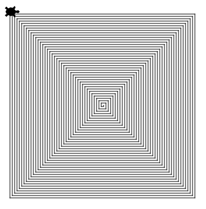

Opdracht 5-1: Spiraal
:::::::::::::::::::::

Opdracht
--------

Hieronder zie je een spiraal dat uit 160 strepen bestaat. Het allereerste
streepje is 0 pixels lang. Vervolgens wordt een 90 graden hoek naar rechts
gemaakt. Daarna een streepje van 2 pixel lang. Dan weer een 90 graden hoek naar
rechts. Daarna een streepje van 4 pixels lang, et cetera.

Teken het plaatje na. Maak gebruik van wat je geleerd hebt over
``for i in range(...)``.

.. activecode:: opg-functions-spiraal
   :caption: Een hele lange spiraal
   :nocodelens:
   :language: python
   :enabledownload:

   import turtle
   tina = turtle.Turtle()
   tina.shape("turtle")
   tina.speed(10)
