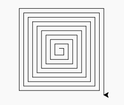

Opdracht 5-2: Spiraal2
::::::::::::::::::::::

Opdracht
--------

Maak nu een programma waarmee je de volgende spiraal kan maken. Het eerste
streepje is 10 pixels lang. De stappen zijn 5 pixels lang. De laatste streep is
195 pixels lang.

Hiervoor maak je uiteraard gebruik van wat je geleerd hebt over de functie
``range(...)``

.. activecode:: opg-counters-spiraal2
   :caption: Spiraal2
   :nocodelens:
   :language: python
   :enabledownload:

   import turtle
   tina = turtle.Turtle()
   tina.shape("turtle")
   tina.speed(0)
