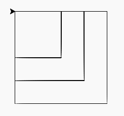

Eindopdracht hoofdstuk 3
::::::::::::::::::::::::

Net als bij hoofdstuk 1 is als afsluiting van het hoofdstuk is hieronder een
eindopdracht. Deel 1 van deze opdracht is vergelijkbaar met vorige opdrachten
-- je moet wederom een figuur natekenen met tina -- al zal dit nu iets meer
werk zijn. Deel 2 van de opdracht voer je uit op moodle nadat je je code hebt
ingeleverd. Je moet dan een paar vragen over je gemaakte programma invullen.

Voor deze opdracht krijg je een beoordeling (``o``, ``t`` of ``v``). Als je
deze niet voldoende gemaakt hebt is er overigens wel de mogelijkheid een
herkansingsopdracht te maken.

Eindopdracht
------------

Maak drie functies:

#. Een functie genaamd ``vierkant200()`` die een geel vierkant met zijden 200
   tekent;
#. Een functie genaamd ``vierkant150()`` die een groen vierkant met zijden 150
   tekent;
#. Een functie genaamd ``vierkant100()`` die een blauw vierkant met zijden 100
   tekent;
#. Als je dan achtereenvolgens ``vierkant200``, ``vierkant150`` en
   ``vierkant100`` aanroept ziet het eruit als hieronder.

.. activecode:: h3f1_vierkanten
  :caption: Vierkantfuncties
  :nocodelens:
  :language: python
  :enabledownload:

  import turtle
  tina = turtle.Turtle()
  tina.shape("turtle")
