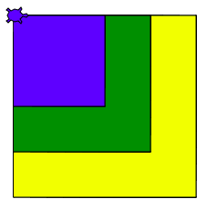

:orphan:

Herkansing eindopdracht hoofdstuk 3
:::::::::::::::::::::::::::::::::::

Eindopdracht
------------

Eindopdracht
------------

Maak drie functies:

#. Een functie genaamd ``vierkant200()`` die een geel vierkant met zijden 200
   tekent;
#. Een functie genaamd ``vierkant150()`` die een groen vierkant met zijden 150
   tekent;
#. Een functie genaamd ``vierkant100()`` die een blauw vierkant met zijden 100
   tekent;
#. Als je dan achtereenvolgens ``vierkant200``, ``vierkant150`` en
   ``vierkant100`` aanroept ziet het eruit als hieronder.

.. activecode:: h3f1_vierkanten
  :caption: Vierkantfuncties
  :nocodelens:
  :language: python
  :enabledownload:

  import turtle
  tina = turtle.Turtle()
  tina.shape("turtle")
