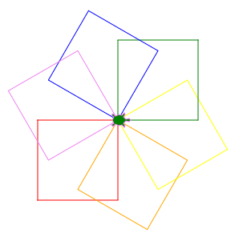

Opdracht 3-3: Gedraaide gekleurde vierkanten
::::::::::::::::::::::::::::::::::::::::::::

Opdracht
--------

Teken de onderstaande figuur na met behulp van een loop en de functie
``maakvierhoek()``.

.. activecode:: h3o3_gedraaide-gekleurde-vierkanten
   :caption: Regenboogvierkanten
   :nocodelens:
   :language: python
   :enabledownload:

   import turtle
   tina = turtle.Turtle()
   tina.shape("turtle")
   tina.speed(10)

   def maakvierhoek():
       for i in range(4):
           tina.right(90)
           tina.forward(100)
