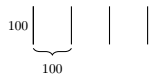

Oefenopdrachten (3): Patronen
:::::::::::::::::::::::::::::

Nu volgen er een aantal voorbeeldfiguren met beginnetjes code. Pas de code telkens op zo'n manier aan dat de turtle de figuur tekent. De afmetingen staan in de figuur vermeld, die getallen hoef je er dus niet bij te zetten.

1. Verticale strepen
--------------------

Schrijf een programma die de onderstaande tekening maakt.

.. activecode:: oefen-iteration-verticale-strepen
   :caption: Trap
   :nocodelens:
   :language: python
   :enabledownload:

   import turtle
   tina = turtle.Turtle()
   tina.shape("turtle")
