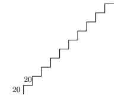

Opdracht 2-1: Trap
::::::::::::::::::

Hieronder staat een voorbeeldfiguur en een beginnetje van een programma. Pas de
code aan zodat tina de figuur tekent. De getallen die in de figuur staan zijn
afmetingen, deze hoef je uiteraard niet in jouw tekening erbij te zetten.

Als een geheugensteuntje staat een samenvatting van de  programmeercodes die je
tot nu toe dit hoofdstuk geleerd hebt hieronder.

Opdracht
--------

Teken de onderstaande trap met zo min mogelijk regels code.

.. activecode:: h2o3_trap
   :caption: Trap
   :nocodelens:
   :language: python
   :enabledownload:

   import turtle
   tina = turtle.Turtle()
   tina.shape("turtle")

Samenvatting (2-1)
------------------

.. code-block:: python

   for i in range(<aantal>):
       <code>

herhaal de <code> <aantal> keer
