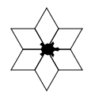
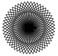

Eindopdracht hoofdstuk 4
::::::::::::::::::::::::

Als afsluiting van het hoofdstuk is hieronder een eindopdracht. Deel 1 van deze
opdracht is vergelijkbaar met vorige opdrachten -- je moet wederom een figuur
natekenen met tina -- al zal dit nu iets meer werk zijn. Deel 2 van de opdracht
voer je uit op moodle nadat je je code hebt ingeleverd. Je moet dan een paar
vragen over je gemaakte programma invullen.

Voor deze opdracht krijg je een beoordeling (``o``, ``t`` of ``v``). Als je
deze niet voldoende gemaakt hebt is er overigens wel de mogelijkheid een
herkansingsopdracht te maken.

Eindopdracht
------------

Een sneeuwvlokje kun je maken door een paar parallellogrammen aan te plakken. Zie bijvoorbeeld:

In het eerste plaatje zijn er zes parallellogrammen naast elkaar getekend (de turtle draait na elke parallellogram een aantal graden naar rechts en tekent vervolgens de volgende). Bij de volgende sneeuwvlok zijn het ook allemaal parallellogrammen die naast elkaar zijn getekend (je hoeft niet te tellen hoeveel dat er zijn ;))

Maak eerst een functie ``sneeuwvlok`` die het linker plaatje tekent. De functie ``sneeuwvlok`` moet gebruik maken van de functie ``parallellogram`` die je van mij cadeau krijgt.

.. activecode:: h4f1_sneeuwvlok
   :caption: Nog meer huizen
   :nocodelens:
   :language: python

   import turtle
   tina = turtle.Turtle()
   tina.shape("turtle")
   tina.speed(10)

   def parallellogram(lengte):
       for i in range(2):
           tina.forward(lengte)
           tina.right(60)
           tina.forward(lengte)
           tina.right(120)

   def sneeuwvlok(lengte):
       parallellogram(lengte)

   sneeuwvlok(30)

Breid de functie sneeuwvlok uit door nog een parameter te gebruiken. Met deze tweede parameter kun je aangeven hoeveel parallellogrammen er in een sneeuwvlok moeten zitten. Dus als je ``sneeuwvlok(30, 6)`` uitvoert, dan maakt de turtle het eerste plaatje. Maar als je ``sneeuwvlok(30, 50)`` uitvoert, dan begint de turtle iets te maken wat op het tweede plaatje gaat lijken.
