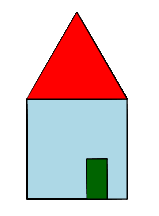

Eindopdracht hoofdstuk 1
::::::::::::::::::::::::

Als afsluiting van het hoofdstuk is hieronder een eindopdracht. Deel 1 van deze
opdracht is vergelijkbaar met vorige opdrachten -- je moet wederom een figuur
natekenen met tina -- al zal dit nu iets meer werk zijn. Deel 2 van de opdracht
voer je uit op moodle nadat je je code hebt ingeleverd. Je moet dan een paar
vragen over je gemaakte programma invullen.

Voor deze opdracht krijg je een beoordeling (``o``, ``t`` of ``v``). Als je
deze niet voldoende gemaakt hebt is er overigens wel de mogelijkheid een
herkansingsopdracht te maken.

Eindopdracht
------------

Laat tina het onderstaande huis tekenen. De breedte van het huis is ``100`` en
de gebruikte kleuren zijn ``light blue``, ``dark green`` en ``red``.
Let erop dat je ``tina.begin_fill()`` en ``tina.end_fill()`` op de juiste
momenten gebruikt zodat de figuur netjes opgevuld wordt.

.. activecode:: h1f1_huis
   :caption: Huis
   :nocodelens:
   :language: python
   :enabledownload:

   import turtle
   tina = turtle.Turtle()
   tina.shape("turtle")
